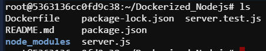
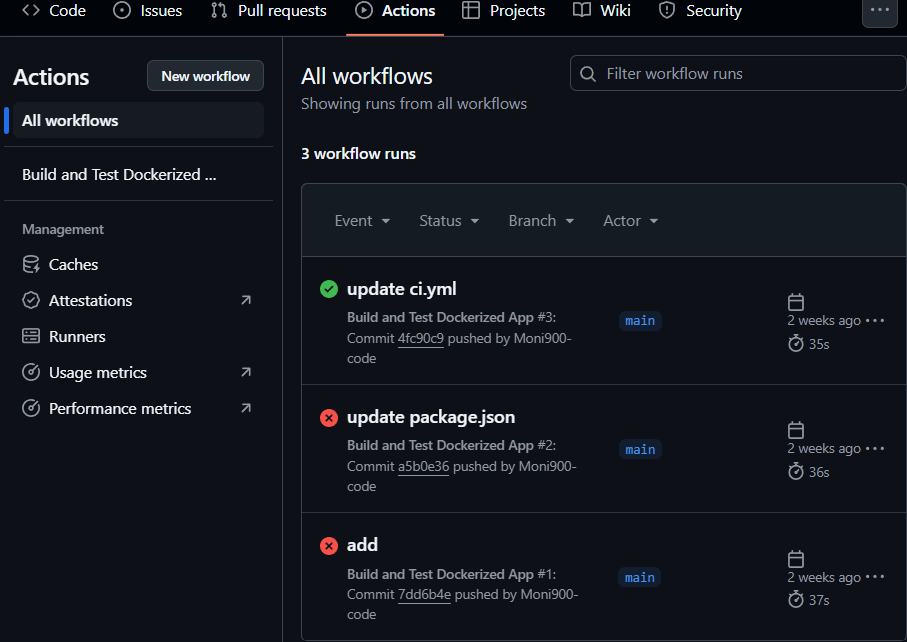

#  Build and Test Dockerized Node.js App with GitHub Actions

## What's the mean of Dockerized Node.js app?

In this process, a Node.js app is packaged into a Docker container, and **GitHub Actions** is used to automatically build and test it.  
This ensures that after every code change, the system checks whether everything is working properly or not.

Let's see an example to understand the topic. Imagine you’ve built an app called **"Pathshala"** — a small Node.js-based web app where students can share class notes. Everything works fine on your laptop — the server runs, features work, and tests pass.

You think, *“Everything’s good, let me push it to GitHub and deploy to production!”*

But once it’s in production, you realize:

- The app isn’t running.
- A required package wasn’t installed.
- The Node.js version is different.
- Or maybe the `.env` file is missing!

**The issue? Your local environment is different from the production environment — and that’s why the code fails to run.**

## This is exactly where **Docker** and **GitHub Actions** come to the rescue.

## So, What Should You Do?
- You containerize your app using **Docker** — so the entire codebase, dependencies, and Node.js version are all bundled together.
- Then you set up **GitHub Actions** to build and test your Docker container automatically whenever code is pushed.
  The workflow will:
    - Build the Docker image
    - Run tests **inside** the container
    - Do this **automatically** every time you push code!

---

## Workflow Diagram:


## Why Use This?

- **Production readiness**: Docker makes your app ready for deployment
- **Consistency**: Same behavior across local, testing, and production
- **Catch bugs early**: Tests run immediately after pushing code
- **Automation**: No manual steps required
- **Team collaboration**: Everyone knows if the code passes or fails

##  When to Use This?

- When you’re using Docker  
- When you’re working in a team and need code validation  
- When you need to run tests before deploying to production  
- When you want quick feedback after code changes  

## Where to Use This?

- **GitHub Repositories** – wherever your code is hosted  
- **CI/CD Pipelines** – GitHub Actions, GitLab CI, Jenkins  
- **Cloud Deployment Platforms** – Render, Railway, Heroku, AWS EC2, ECS  
- **Open-source Projects** – to validate code from contributors  

---

## Task Goal
Automatically **build a Docker image** and **run tests inside the container** every time code is pushed to the repository.

---

## ✅ Steps to Complete the Task

### 1. Create a Dockerfile 

- For **Node.js**, the Dockerfile might look like:

```Dockerfile
FROM node:18
WORKDIR /app
COPY package.json package-lock.json ./
RUN npm install
COPY . .
EXPOSE 3000
CMD ["node", "server.js"]
```

### 2. Create a GitHub Actions Workflow File
- Create .github/workflows/docker-ci.yml
#### This action will build the Docker image using your Dockerfile and run the command inside it (e.g., npm test or pytest).

 

### 3. Create Node.js Application

### 📌 Node.js App Setup


```bash
mkdir Dockerized_Nodejs && cd Dockerized_Nodejs
npm init -y
npm install express
npm install --save-dev jest supertest
```
Now, create some basic files:
1. server.js 
2. server.test.js 



And add the test script in package.json file as like this:

```bash
"scripts": {
  "start": "node index.js",
  "test": "jest"}

```
Here, **jest** use for **Node.js**


## 4. Push to GitHub Repository
After setting everything up, push the all code files to GitHub:
```bash
git init
git add .
git commit -m "Initial commit"
git branch -M main
git remote add origin https://github.com/your-username/your-repo.git
git push -u origin main
```

## 3. CI/CD in Action
Every time anyone push code:

- Docker image is rebuilt

- App runs in a container

- Tests run inside the container

- Status is shown in GitHub Actions like this: 

  

This way, we can complete the Dokerized Nodejs Application using GitHub Actions.
